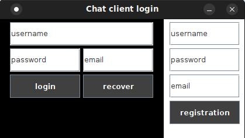
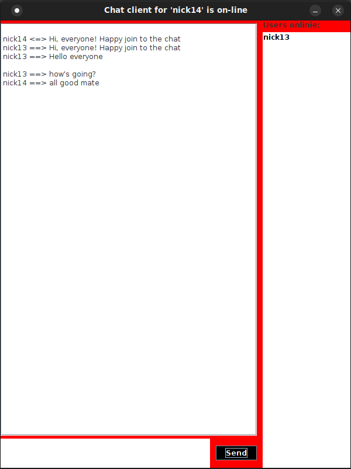

<h1>Client Server GUI chat</h1>
Client server GUi chat based on sockets.

<h3>Description</h3>

This is a simple client-server app based of java-sockets with some gui. 

You can register a new user and after login with username and password.

If you forgot your password you can recover it and get it via gmail service.

Login page example bellow:

After login you will get an access to common chat window:

You can see all online users on right part of the window.

With click on user name you can send a private message:

<h3>Technologies:</h3>
 - java core with sockets;
 - jdbc driver
 - DB: MySQL;
 - gui: Swing;
 - Maven.

<h3>Building</h3>
You can use maven for project building or open it in Intellj Idea.

Build with maven command: 

``mvn build``

<h3>Database</h3>

There is a ``chat_base_schema.sql`` schema with information about all tables for this project. You need to create it before run the server.

<h3>Run</h3>
There are 2 classes Server.Main and Client.Main.

First you need to Server.Main with 

 - DBHOST - database connection url for jdbc driver (example: ``jdbc:mysql://localhost:3306/chat_base`` )
 - USER - database user (example ``user``)
 - DBPASSWORD - database password (example: ``very-strong-password`` )
 - SERVERPORT - the port on which the server will run (example ``1234``)
 - EMAIL - email for sending recovery message via gmail (example ``example@gmail.com``)
 - EMAIL_PASSWORD - password for sending recovery message via gmail  (example ``very-strong-password``)

environment variables. It will provide necessary connection to database.

After for each client you need to provide 

 - SERVERADDRES - ip address with server (example: ``127.0.0.1`` )
 - SERVERPORT - server port (example: ``1234`` )

environment variables for connection to your server.

